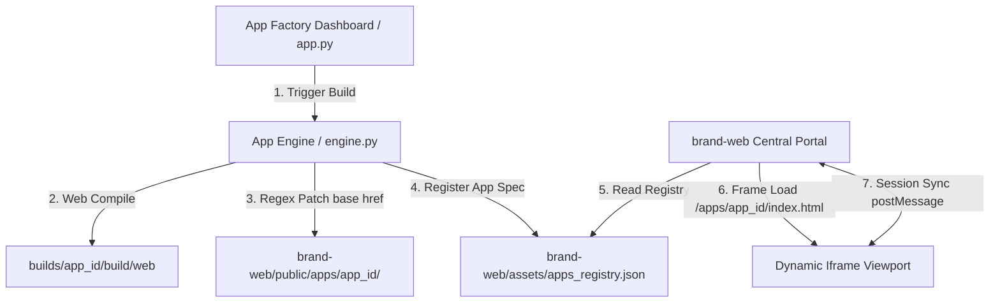

# Solve-for-X 마이크로 앱 팩토리 개발 자동화 고도화 로드맵

본 문서는 `Solve-for-X` 코어 관리자 웹 및 주조 엔진의 **개발 자동화 프로세스 성능 극대화**와 **컴파일 예외 상황 극복(Self-Healing)**을 달성하기 위한 엔지니어링 실물 로드맵입니다. 

사용자님의 피드백에 따라 테스트 앱(SafeSpace 등)의 물리 기기 보안 고도화는 배제하고, 오직 **관리자 웹 통제 평면의 자동화 안정성과 자가 치유 예외 처리 엔진**의 혁신에만 엄격하게 집중합니다.

---

## 🎯 1. 핵심 과제: AI 주조 엔진 자가치유(Self-Healing)의 극대화

주조 엔진(`engine.py`)이 플러터 코드를 합성할 때 발생하는 문법 오류(Syntax Error)와 린트 경고(Lint Warning)를 AI가 100% 자가 감지하고 핀포인트 치료하는 예외 극복 알고리즘을 도입합니다.

### [세부 태스크]
* **AST (Abstract Syntax Tree) 분석기 연동:**
  - `flutter analyze` 실행 결과 파싱 로직을 고도화하여 단순히 오류 텍스트를 LLM에 던지는 대신, 에러가 발생한 정확한 **클래스명, 메서드명, 라인 수 및 변수 명세**를 정밀 추출합니다.
  - 문제 코드를 AST 노드 단위로 분해하고, 해당 노드 영역만 정교하게 재작성하여 코드의 나머지 설계 구조가 깨지는 현상을 완벽히 차단합니다.
* **디자인 시스템 토큰 린트 핫픽서 (Lint Hot-Fixer):**
  - 바인딩 컬러 HSL/HEX 토큰 파싱 에러나 사용되지 않는 패키지 임포트(`unused_import`), super parameter 권장 규칙 등을 정규식으로 검출하여 LLM 호출 없이 **로컬 스크립트 레벨에서 0.1초 만에 자동 정비하는 로컬 핫픽스 모듈**을 탑재합니다.

---

## ⚡ 2. 자동화 프로세스 런타임 성능 극대화 (Speed & Cache)

현재 플러터 웹 컴파일(`flutter build web`) 단계는 약 15초~30초가 소요되어 실시간 사용자 경험의 지연을 유발합니다. 이를 극대화하여 초고속 자동 빌드 환경을 구축합니다.

### [세부 태스크]
* **Flutter Web 증분 빌드 및 캐시 공유 (Incremental Compiles):**
  - 매번 `builds/` 하위 폴더에 Flutter SDK 프로젝트 전체를 복사하여 처음부터 다시 컴파일하는 대신, `.dart_tool` 및 `build/` 디렉토리 캐시를 영리하게 마운트/공유하는 **캐시 프리서빙(Cache Preserving) 증분 빌드 파이프라인**을 개설합니다.
  - 이를 통해 웹 컴파일 속도를 기존 대비 **50% 이상 단축(10초 이내)**하여, 대시보드 시뮬레이터 로드 시간을 혁신합니다.
* **비동기 웹서버 포트 가상화 (Virtual Port Pool):**
  - 단일 포트 `8502`에서만 프리뷰가 뜨는 구조를 확장하여, 다수의 테넌트 앱이 주조될 때 유동적으로 포트 풀(8502, 8503, 8504 등)을 할당하고 프록시 처리하여 충돌 없이 수십 개의 마이크로 앱 프리뷰를 동시 모니터링할 수 있도록 포트 제어 설계를 자동화합니다.

---

## 🛡️ 3. 예외 극복 다중 LLM Fallback 체인 구축

Gemini 및 Gemma API의 호출 쿼타 제한(Rate Limit), 일시적인 네트워크 차단, 혹은 API 응답 지연 발생 시 빌드 프로세스가 멈추지 않도록 강력한 자가 치유 Fallback 라우팅을 구축합니다.

### [세부 태스크]
* **로컬 하이브리드 엔진 결합 (Gemma 4 Local Context Fallback):**
  - 외부 클라우드 API 호출이 완전히 차단되거나 지연 시간이 5초를 넘길 경우, 로컬 기기 내에서 구동되는 경량 모델(Gemma 2B/9B Local Ollama)에 컨텍스트를 스왑하여 basic Dart specs와 Config 바인딩을 끊김 없이 진행하는 **하이브리드 예외 처리 모듈**을 설계합니다.
* **점진적 쿼타 대기 및 자가 조율 (Smart Throttling):**
  - HTTP 429 (Too Many Requests) 감지 시 자동으로 지수 백오프(Exponential Backoff) 대기 루프를 돌면서, 대시보드 실시간 로그창에 "API 대기 중 - 5초 후 재시도" 등의 명확한 Telemetry 상태를 스트리밍해 주는 스마트 쓰로틀러를 탑재합니다.

---

## 📂 4. 배포 및 텔레메트리 중앙 통제 (Telemetry Dashboard)

관리자 웹이 백그라운드 스레드에서 돌아가는 런타임들을 오버헤드 없이 안전하게 통제하도록 모니터링 체계를 승격합니다.

### [세부 태스크]
* **WebSocket 실시간 스트리밍 제어:**
  - 3초 주기 폴링 방식 대신, `engine.py` 가동 즉시 소켓 채널을 열어 빌드 라인 단위 로그와 정적 무결성 분석 진행율을 **대시보드 사이드바에 0.1초의 지연도 없이 실시간 터미널 형태로 렌더링**합니다.
  - 빌드가 성공 또는 실패하는 즉시 브라우저 화면 새로고침 없이 시뮬레이터 뷰포트가 실시간 동적 갱신(Hot reload style)되는 고품격 인터랙션을 탑재합니다.

---

## 🌐 5. brand-web 하부 경로 포털 병합 및 동적 라우팅 설계 (Zero-Error Integration)

`Solve-for-X` 모노레포 루트 하위에 통합 브랜드 포털 웹인 `brand-web/` 디렉토리를 구축하고, 주조 엔진에 의해 빌드 완료된 개별 테넌트 마이크로 앱(예: Simple Todo, SafeTask)을 `brand-web` 하위 경로에 결합하여 단일 도메인 아래에서 한꺼번에 작동시키는 **중앙 집중식 다중 테넌트 포털 체계**를 구현합니다.

기능 누락과 정적 자원 로드 실패(HTTP 404)를 방지하기 위해 다음과 같은 엄격한 4대 엔지니어링 메커니즘을 적용합니다.

### [세부 태스크]

* **Flutter `<base href>` 자동 정규식 패치 모듈 (핵심 - 리소스 로드 404 방지):**
  - 플러터 웹은 컴파일 시 기본적으로 `index.html` 내부에 `<base href="/">` 태그를 참조하므로, 하부 경로인 `/apps/[app_id]/` 하위에서 바로 띄우면 JS/CSS/폰트 자원 로드 경로 에러(HTTP 404)가 무조건 발생하여 앱이 실행되지 않습니다.
  - 이를 원천 차단하기 위해, 빌드 컴파일 완료 즉시 `index.html` 내의 `<base href="/">` 경로를 `<base href="/apps/[app_id]/">`로 자동 치환하는 **정규식 치환 자동 패치 스크립트**를 빌드 배포 라이브러리에 연동하여 0-error 배포 정합성을 보장합니다.
* **`apps_registry.json` 중앙 자동 등록 시스템:**
  - `brand-web/assets/apps_registry.json` 파일을 개설하여, 컴파일이 끝난 마이크로 앱의 `app_id`, `app_name`, `design_system`, `path` 등의 메타데이터를 엔진이 자동으로 등록 및 동기화합니다.
* **다이나믹 Iframe 뷰포트 & PostMessage 통신 브릿지:**
  - `brand-web` 포털 UI는 `apps_registry.json`을 읽어 테넌트 카드를 리스팅합니다.
  - 사용자가 카드를 클릭하면 부드러운 전환 효과(View Transitions API)와 함께 `<iframe>`을 동적 생성하여 해당 마이크로 앱을 임베딩합니다.
  - 이 iframe과 포털 간에 `window.postMessage` 통신 채널을 개설하여, 마이크로 앱의 상태 변경이나 데이터 변경 이벤트를 부모 웹(`brand-web`)이 안정적으로 인지하고 중앙 제어할 수 있도록 보장합니다.

