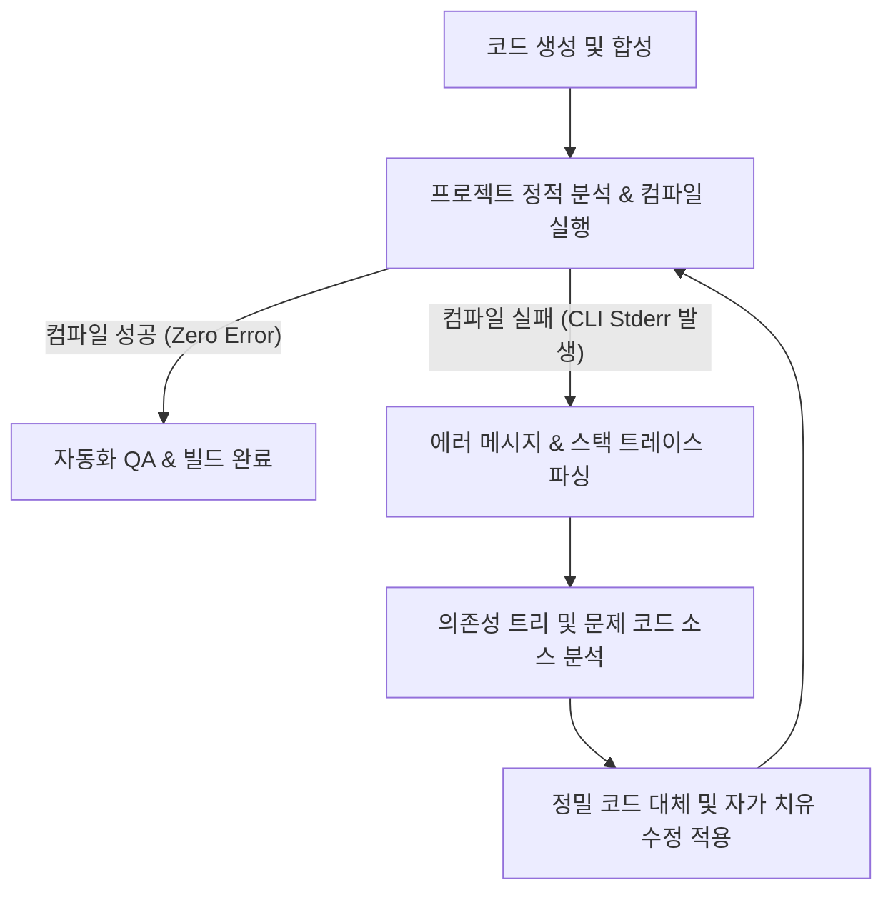

# [비즈니스 팩토리 편] 3장. 에이전트 주도 개발(Agent-Driven Development)의 실제
**부제: 설계도(Blueprint) 한 장으로 가동되는 AI 무인 생산 라인과 자가 치유 컴파일 루프**

2장에서 우리는 1인 개발 공장의 지속 가능한 성장을 위한 인프라 계층의 고립화, 즉 인증(Auth), 결제(Billing), 알림(Notification) 모듈을 완벽히 디커플링된 독자적 레고 블록 형태로 분리했습니다. 또한 이를 의존성 주입(Dependency Injection) 메커니즘을 통해 코어 템플릿 프레임워크에 매끄럽게 연결하는 구조적 기틀을 완성했습니다. 

규격화된 섀시(Chassis)와 레고 블록 형태의 정밀 가공 부품이 조립 라인에 정렬되었습니다. 그렇다면 이제 이 부품들을 조립하여 완성품으로 만들어내는 "실제 조립 노동"은 누가 담당할까요? 여전히 인간 개발자가 에디터를 켜고, 각 모듈을 수동으로 임포트하며, 비즈니스 요건에 맞춰 뷰(View)를 한 땀 한 땀 코딩하고 있어야 할까요? 만약 그렇다면 우리는 여전히 반자동화된 공장에 머물러 있는 것입니다.

Solve-for-X 공장의 최종 단계는 인간이 코드 구현의 노동에서 완전히 해방되는 **'에이전트 주도 개발(Agent-Driven Development, ADD)'**의 실현입니다. 인간은 오직 제품의 의도와 비즈니스 요건을 담은 단 한 장의 '설계도(Blueprint)'만을 작성해 던집니다. 그 이후의 코드 생성, 의존성 조립, 라우터 레지스트리 갱신, 그리고 실패한 컴파일을 스스로 읽고 고쳐나가는 자가 치유(Self-Healing) 프로세스까지—모든 공정은 로컬 AI 에이전트 오케스트레이션에 의해 무인(Hands-off)으로 가동됩니다.

---

### 🤖 단순 자동 완성을 넘어: 에이전트 주도 개발(ADD)의 정의

기존의 개발 프로세스에서 AI는 주로 GitHub Copilot이나 Cursor와 같이 인간의 코딩을 옆에서 보조하는 '조수' 역할에 머물렀습니다. 개발자가 파일을 열고 타이핑을 하면 실시간으로 다음 라인을 제안하거나, 특정 함수를 리팩토링해 주는 수준입니다. 이 방식은 여전히 인간 개발자가 코드베이스의 전체 컨텍스트를 머릿속에 쥐고 있어야 하며, 파일 간의 결합도를 조율하고, 빌드 에러를 직접 추적해 해결해야 하는 주도적 노동을 필요로 합니다.

반면, **에이전트 주도 개발(ADD)**은 인간이 에디터를 전혀 잡지 않는 '완전 자율형 패러다임'입니다. 
*   **목적 기반 자율 실행:** 인간은 파일 단위의 지시를 내리지 않습니다. 대신 `"Memento Mori 기능이 탑재된 타이머 앱을 생성하고, 광고 결제 블록과 Supabase Auth 블록을 주입해 줘"`와 같은 고수준의 기능 규격(Specification)을 제공합니다.
*   **컨텍스트 이해와 계획 수립:** AI 에이전트(Hermes와 OpenAgent)는 프로젝트의 디렉토리 구조, 공통 모듈의 인터페이스 계약, 아키텍처 규칙을 스스로 분석하여 여러 파일에 걸친 변경 계획(Step-by-step Action Plan)을 자율적으로 수립합니다.
*   **자율 도구 사용 (Tool Use):** 파일 생성 및 수정, CLI 명령 실행, 테스트 코드 구동 등 개발에 필요한 모든 도구를 에이전트가 직접 제어하며 개발을 진행합니다.

이러한 자율 개발이 현실적으로 높은 성공률을 기록할 수 있는 것은, 앞서 1장과 2장에서 정립한 **생산 라인의 강력한 표준화**와 **레고 블록 아키텍처** 덕분입니다. 예측 불가능한 카오스 상태의 코드베이스에서는 AI 에이전트도 길을 잃고 헤매지만, 한 치의 오차도 없는 표준 레일 위에서는 극도의 연산 효율성을 발휘하며 정교하게 코드를 합성해 냅니다.

### ⚙️ 무인 생산 라인의 3단계 파이프라인

에이전트 주도 개발 파이프라인에 주입되는 핵심 입력물은 JSON 규격으로 작성된 **`app_blueprint.json`**입니다. 이 설계도는 신규 제품의 브랜드 아이덴티티와 활성화할 공통 모듈, 그리고 독자적인 도메인 피처 요건을 명확히 명시합니다.

```json
{
  "app_name": "MementoMoriTimer",
  "theme": {
    "primary_color": "#1A1A1A",
    "accent_color": "#D4AF37",
    "typography": "Outfit"
  },
  "infrastructure_modules": {
    "auth": {
      "provider": "supabase",
      "required_providers": ["email", "apple"]
    },
    "billing": {
      "engine": "revenuecat",
      "is_subscription": true
    },
    "notifications": {
      "channel": "fcm_and_telegram"
    }
  },
  "domain_features": [
    {
      "name": "life_expectancy_calculator",
      "state_management": "riverpod",
      "views": ["InputScreen", "DashboardScreen"]
    }
  ]
}
```

에이전트는 이 설계도를 수신하는 즉시 다음 3단계 조립 파이프라인을 작동시킵니다.

#### 1단계: 블루프린트 파싱 및 스캐폴딩 (Parsing & Scaffolding)
에이전트는 `app_blueprint.json`을 읽고 타겟 플랫폼(Flutter/Next.js)에 맞는 표준 아키텍처 프레임워크를 기반으로 프로젝트 뼈대를 자동 스캐폴딩합니다. 테마 스타일 가이드(`design_tokens.json`)를 해석하여 다크모드 테마와 글로벌 색상 에셋을 지정된 UI 경로에 자동으로 선언해 둡니다.

#### 2단계: 의존성 주입 및 모듈 장착 (Dependency Injection & Wiring)
설계도의 `infrastructure_modules` 명세를 분석하여, 2장에서 기성품으로 제작해 둔 레고 블록 모듈들을 프로젝트 내부로 불러옵니다. 
에이전트는 의존성 주입 파일(`service_locator.dart`)을 파싱한 후, 적절한 위치에 필요한 서비스 인스턴스를 주입하는 바인딩 코드를 동적으로 작성합니다:

```dart
// service_locator.dart 내에 에이전트가 자동 생성한 주입 코드
void setupLocator() {
  // 공통 Core 모듈 초기화
  sl.registerLazySingleton<NetworkClient>(() => SupabaseNetworkClient());

  // Blueprint에 명시된 결제 및 인증 모듈 동적 결합
  sl.registerLazySingleton<AuthService>(() => SupabaseAuthService());
  sl.registerLazySingleton<BillingService>(() => RevenueCatBillingService(isSubscription: true));
  
  // 알림 및 텔레그램 피드백 채널 가동
  sl.registerLazySingleton<NotificationBridge>(() => FCMTelegramNotificationBridge());
}
```

이어서 라우터 시스템(`app_router.dart`)에 접근하여, 새로 장착된 인증 스트림의 가드(Auth Guard) 상태를 파악하고, 비인증 유저는 로그인 화면으로 리다이렉트하는 흐름까지 완벽히 배선(Wiring)합니다.

#### 3단계: 도메인 뷰(View)의 정밀 합성
표준 규격에 맞게 설계된 Riverpod 상태 노티파이어와 스크린 위젯을 자동 합성합니다. 1장에서 명시했던 일관된 디자인 가이드라인에 부합하도록, 에이전트는 스타일 토큰을 백분 활용하여 버튼의 둥글기 값, 패딩 크기, 폰트 자간까지 완벽히 일관된 고품질의 도메인 화면들을 순식간에 구현해 냅니다.

### 🔄 컴파일 자가 치유(Self-Healing) 루프: 무인 공장의 핵심 엔진

에이전트가 코드를 아무리 영리하게 작성하더라도, 컴파일 타임에 예기치 못한 정적 분석 에러나 빌드 오류가 발생할 수 있습니다. 예를 들어, 특정 패키지의 임포트 경로가 어긋났거나, API의 세부 파라미터 타입이 소폭 일치하지 않는 등의 미시적 결함이 발생할 가능성이 존재합니다. 

일반적인 자동화 도구들은 빌드가 실패하면 가동을 멈추고 인간에게 에러 메시지를 보냅니다. 하지만 Solve-for-X의 ADD 아키텍처는 에러가 발생한 시점부터 진정한 위력을 발휘합니다. 에이전트는 빌드 실패를 오류로 규정하고 중단하는 것이 아니라, 하나의 피드백 신호로 받아들여 즉시 **'자가 치유(Self-Healing) 컴파일 루프'**에 진입합니다.



이 루프가 작동하는 과정을 리얼타임 CLI 로그 시뮬레이션으로 살펴보겠습니다:

```text
$ flutter analyze
Analyzing Solve-for-X app...
  error • Undefined class 'RevenueCatBillingService' at lib/core/di/service_locator.dart:18:41 • (undefined_class)
  info  • Unused import: 'package:memento_mori/core/auth/auth_service.dart' at lib/features/calculator/views/input_screen.dart:4:8 • (unused_import)

[Agent System: INFO] 정적 분석 실패 감지. 에러 패턴 식별 시작.
[Agent System: TRACE] 'RevenueCatBillingService' 클래스가 정의되지 않았습니다. 누락된 라이브러리 임포트 조사 중...
[Agent System: RESOLVE] 'package:memento_mori/core/billing/revenue_cat_billing_service.dart'의 존재를 감지. service_locator.dart 헤더에 임포트 구문 누락 확인.
[Agent System: PATCH] 'service_locator.dart' 라인 3에 임포트 구문 삽입 실행.
[Agent System: PATCH] 'input_screen.dart' 라인 4의 불필요한 임포트 구문 제거 실행.

$ flutter analyze
Analyzing Solve-for-X app...
No issues found! (Analysis passed in 1.4s)

[Agent System: SUCCESS] 컴파일 자가 치유 완료. 100% 정상 가동 상태 빌드 확보.
```

에이전트는 정적 분석기(Linter)와 컴파일러가 출력하는 `stderr` 메시지를 직접 소화합니다. 에러의 유형(타입 불일치, 임포트 누락, 클래스명 오타 등)을 정밀 분석하고, 에러가 발생한 지점의 소스 코드로 찾아가 코드를 스스로 고쳐 씁니다. 에러가 완전히 소멸하여 `Exit Code 0`을 반환할 때까지 이 컴파일-분석-수정의 자가 치유 루프를 반복 구동합니다. 

이 회복 탄력성(Resilience) 기술 덕분에, 시스템은 인간의 개입이 전혀 없이도 극도로 안정적인 작동 상태의 완성형 빌드를 스스로 깎아낼 수 있습니다.

### 🧪 통합 자율 QA와 시뮬레이션 회귀 테스트

컴파일이 통과되면 마지막 관문인 QA 단계로 넘어갑니다. 
에이전트는 에뮬레이터 또는 헤드리스 브라우저 환경에서 실제 앱의 구동 화면을 캡처하고, 레이아웃의 비정상적인 깨짐이나 겹침 현상이 발생하는지 시각적 회귀 분석을 돌립니다. 

이후 각 모듈이 격리된 테스트 환경에서 의도대로 상태 변경을 수용하는지 통합 시나리오 테스트를 실행하며, 이 모든 검증 기록은 마크다운 형태의 자율 QA 보고서(`automation_qa_log.md`)로 정밀 보관됩니다. 인간 개발자는 텔레그램을 통해 "빌드 성공 및 자율 QA 통과" 메시지와 함께 완성된 프로덕트의 배포 파일(APK 또는 Web Deploy URL)을 수신하게 됩니다.

---

설계도 한 장만 던져주면 코딩부터 컴파일 오류 해결, 그리고 QA 최종 검증까지 AI가 논스톱으로 수행하는 이 황홀한 생산 라인은 1인 개발자의 한계를 완전히 깨부숩니다. 이로써 하루에 한 개씩 새로운 서비스를 아이디어에서 스토어 출시 단계까지 초고속으로 찍어내는 진정한 '비즈니스 팩토리'가 실현되었습니다.

그러나 이렇게 자율적으로 양산된 다수의 독립적인 서비스들이 개별적으로 고립되어 흩어져 있다면, 유저 입장에서는 매번 회원가입을 새로 해야 하고 데이터가 동기화되지 않는 파편화의 피로감을 느끼게 될 것입니다. 

공장이 찍어낸 프로덕트들이 서로를 강력하게 끌어당기며 하나의 거대한 플랫폼 생태계로 융합되기 위해 필요한 마지막 퍼즐 조각. 그것은 바로 크로스 플랫폼 단일 인증 및 생태계 통합 계층입니다. 다음 4장, **'파편화를 넘어 생태계로: 크로스 플랫폼 인증(SSO)'**에서 개별 제품들이 어떻게 하나의 위대한 유니버스로 연결되는지 그 비밀을 밝힙니다.
