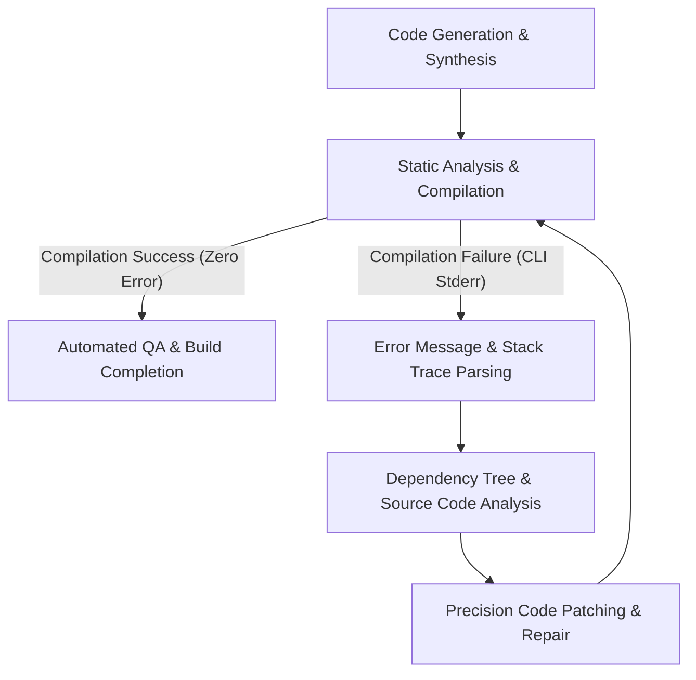

# [Business Factory Series] Chapter 3. Agent-Driven Development (ADD) in Action
**Subtitle: Autonomous Assembly Line Operated by a Single Blueprint and Self-Healing Compilation Loops**

In Chapter 2, we isolated the infrastructure layers necessary for the sustainable growth of our solo software factory, modularizing essential functionalities like authentication (Auth), billing (Billing), and notifications (Notification) into decoupled, independent Lego blocks. We also established the structural foundation to seamlessly connect these blocks to our core template framework using Dependency Injection (DI) mechanisms.

With our standardized chassis and precision-fabricated Lego components aligned on the assembly line, the remaining question is: who performs the actual labor of assembly? Must a human developer still launch the editor, manually import each module, and hand-code the user views based on business requirements? If so, our factory remains only semi-automated.

The ultimate phase of the Solve-for-X software factory is the realization of Agent-Driven Development (ADD), where humans are entirely liberated from the labor of code implementation. Under this paradigm, the human developer simply submits a single, high-level blueprint outlining the product's intent and business requirements. Every subsequent process—including code generation, dependency configuration, routing registry updates, and even a self-healing loop that intercepts and resolves compilation failures—is executed autonomously by our local AI agent orchestration system.

---

### Defining Agent-Driven Development (ADD)

In traditional software development, AI has primarily functioned as an editor-bound assistant, such as GitHub Copilot or Cursor. When a developer types, the AI suggests the next line or refactors a localized function. This model still requires the human developer to maintain the entire system context, coordinate coupling between files, and manually troubleshoot build errors.

In contrast, Agent-Driven Development (ADD) is a fully autonomous, hands-off paradigm:
* Goal-Oriented Autonomous Execution: The human does not provide file-level instructions. Instead, they supply high-level functional specifications, such as "Generate a countdown timer app with Memento Mori features, then inject an ad billing block and a Supabase Auth block."
* Context-Aware Strategic Planning: The AI agents (Hermes and OpenAgent) analyze the target directory structure, common module interface contracts, and architectural rules to devise a multi-file step-by-step action plan autonomously.
* Autonomous Tool Use: The agents directly operate the necessary development tools—generating and modifying source files, executing CLI commands, and running test suites—without human intervention.

This level of autonomy achieves exceptionally high success rates because of the rigorous standardization and Lego block architecture established in Chapters 1 and 2. While AI agents easily lose their way in chaotic, unstandardized codebases, they operate with remarkable efficiency and precision when guided by highly structured architectural constraints.

### The Three-Stage Autonomous Assembly Pipeline

The primary input that drives the Agent-Driven Development pipeline is a JSON-formatted blueprint: `app_blueprint.json`. This document defines the brand identity, specifies the core infrastructure blocks to activate, and outlines the unique business domain features for the new application.

```json
{
  "app_name": "MementoMoriTimer",
  "theme": {
    "primary_color": "#1A1A1A",
    "accent_color": "#D4AF37",
    "typography": "Outfit"
  },
  "infrastructure_modules": {
    "auth": {
      "provider": "supabase",
      "required_providers": ["email", "apple"]
    },
    "billing": {
      "engine": "revenuecat",
      "is_subscription": true
    },
    "notifications": {
      "channel": "fcm_and_telegram"
    }
  },
  "domain_features": [
    {
      "name": "life_expectancy_calculator",
      "state_management": "riverpod",
      "views": ["InputScreen", "DashboardScreen"]
    }
  ]
}
```

Upon receiving this blueprint, the agent triggers a three-stage assembly pipeline:

#### Stage 1: Blueprint Parsing and Scaffolding
The agent parses `app_blueprint.json` and scaffolds the application skeleton based on our standardized framework for the target platform (Flutter or Next.js). It interprets the styling guidelines from `design_tokens.json` to automatically declare global color assets and typography settings in the appropriate UI theme files.

#### Stage 2: Dependency Injection and Module Wiring
The agent evaluates the `infrastructure_modules` section of the blueprint and imports the corresponding Lego blocks into the project. It then parses the DI system configuration (`service_locator.dart`) and dynamically injects the required service registrations:

```dart
// Dependency injection registrations dynamically written by the AI agent in service_locator.dart
void setupLocator() {
  // Initialize shared core modules
  sl.registerLazySingleton<NetworkClient>(() => SupabaseNetworkClient());

  // Dynamically wire authentication and billing modules specified in the blueprint
  sl.registerLazySingleton<AuthService>(() => SupabaseAuthService());
  sl.registerLazySingleton<BillingService>(() => RevenueCatBillingService(isSubscription: true));
  
  // Initialize notifications and Telegram feedback channels
  sl.registerLazySingleton<NotificationBridge>(() => FCMTelegramNotificationBridge());
}
```

Next, the agent accesses the routing configuration (`app_router.dart`) to inspect the authentication state guard, automatically wiring redirection logic to send unauthenticated users to the login screen.

#### Stage 3: High-Fidelity Domain View Synthesis
Using our standardized templates, the agent synthesizes Riverpod state providers and UI screen widgets. Guided by the design tokens established in Chapter 1, the agent maps style variables directly to button corner radii, padding dimensions, and letter spacing, creating visual interfaces that maintain absolute design consistency.

### The Self-Healing Compilation Loop: The Core Engine of the Headless Factory

Even when code is synthesized intelligently, unexpected compilation failures, static analysis errors, or minor linting issues may occur during build time. For instance, a relative import path might be slightly misaligned, or a method parameter type might not perfectly match an updated interface signature.

While conventional automation scripts immediately halt and prompt the developer when a build fails, our ADD architecture uses compilation failures as an informative feedback loop. The agent enters a recursive self-healing compilation loop to resolve the issue independently.



The following terminal output simulation illustrates this self-healing process in action:

```text
$ flutter analyze
Analyzing Solve-for-X app...
  error • Undefined class 'RevenueCatBillingService' at lib/core/di/service_locator.dart:18:41 • (undefined_class)
  info  • Unused import: 'package:memento_mori/core/auth/auth_service.dart' at lib/features/calculator/views/input_screen.dart:4:8 • (unused_import)

[Agent System: INFO] Static analysis failure detected. Initiating error pattern identification.
[Agent System: TRACE] Undefined class 'RevenueCatBillingService'. Searching for missing library imports...
[Agent System: RESOLVE] Detected 'package:memento_mori/core/billing/revenue_cat_billing_service.dart'. Missing import confirmed in service_locator.dart header.
[Agent System: PATCH] Inserting import statement at line 3 of 'service_locator.dart'.
[Agent System: PATCH] Removing redundant import statement at line 4 of 'input_screen.dart'.

$ flutter analyze
Analyzing Solve-for-X app...
No issues found! (Analysis passed in 1.4s)

[Agent System: SUCCESS] Self-healing compilation complete. 100% stable build verified.
```

The agent intercepts the compiler's diagnostic output and evaluates the stderr stream directly. By analyzing the exact error category—whether a type mismatch, a missing import statement, or a typo in a class name—it navigates to the precise location of the defect, applies targeted patches, and re-runs the compilation step. This loop continues recursively until the compiler returns an exit code of zero.

This architectural resilience ensures that our system consistently outputs fully functional, production-ready builds without requiring human troubleshooting.

### Integrated QA and Visual Regression Testing

Once compilation succeeds, the project proceeds to the final quality assurance stage. The agent captures the application's interface states within an emulator or headless browser sandbox and runs visual regression tests to identify layout overlaps or rendering anomalies.

Additionally, it executes integration test suites in mock environments to verify that state updates flow correctly through each module. All validation results are compiled into a markdown report (`automation_qa_log.md`). The human developer simply receives a Telegram notification stating "Build Successful & QA Passed" alongside the final deployment package (e.g., an APK or a web staging URL).

---

By delegating coding, compilation, self-healing repairs, and final QA verification entirely to AI agents, we have eliminated the human limitations that traditionally hinder rapid application delivery. Our solo software factory can now take a new service from conceptualization to a polished, store-ready deployment in a single day.

However, if these rapidly deployed applications remain completely isolated from one another, users will suffer from fragmented experiences—having to sign up repeatedly and manage disconnected datasets.

To unify these separate applications into a cohesive product ecosystem, we require a final integration layer. In Chapter 4, "Beyond Fragmentation: Cross-Platform Authentication (SSO)," we will detail the unified single sign-on architecture that binds our individual products into a unified ecosystem.
