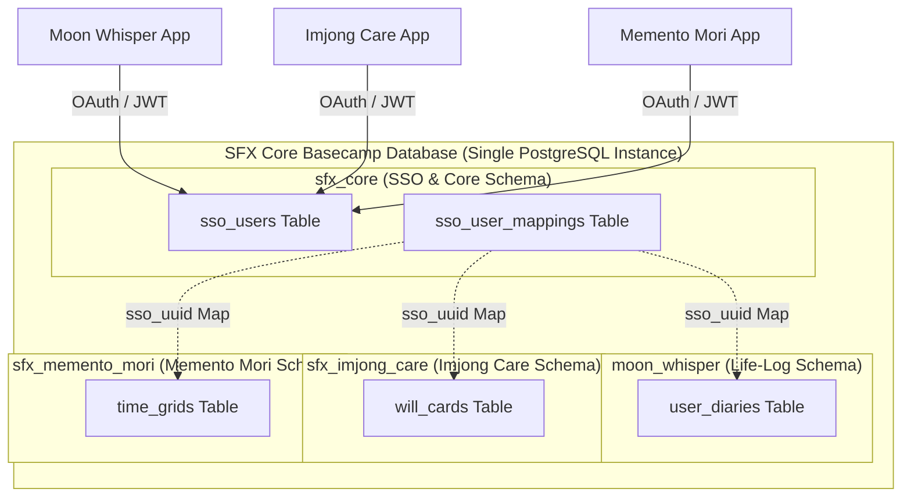

# [비즈니스 팩토리 편] 4장. 파편화를 넘어 생태계로: 크로스 플랫폼 인증(SSO)
**부제: PostgreSQL 멀티테넌시 스키마와 통합 인증 계층을 활용한 1인 개발자의 유저 크로스폴리네이션(Cross-Pollination) 전략**

3장에서 우리는 설계도(Blueprint) 단 한 장만 던져주면 로컬 AI 에이전트(Hermes & OpenAgent)가 빌드부터 자가 컴파일 치유, 그리고 자동 QA까지 원스톱으로 처리하는 **'에이전트 주도 개발(ADD)'**의 기적을 시연했습니다. 이 자동화 라인 덕분에 1인 개발자는 아이디어가 떠오른 당일에 바로 작동 가능한 MVP 앱을 찍어낼 수 있는 초격차 생산성을 확보하게 되었습니다.

하지만 이 눈부신 속도 뒤에는 한 가지 치명적인 비즈니스적 함정이 도사리고 있습니다. 바로 **'유저 경험의 파편화'**와 **'신규 유저 유치 비용(CAC)'**의 문제입니다.

아무리 뛰어난 앱들을 하루에 하나씩 양산하더라도, 각 앱이 완전히 격리된 DB와 각기 다른 가입 프로세스를 가지고 있다면 어떻게 될까요? 유저는 새로운 서비스(예: Memento Mori ⌛)를 이용할 때마다 매번 이메일을 인증하고 비밀번호를 설정해야 하는 피로감을 느낍니다. 이는 서비스 이탈률을 높이는 지름길입니다. 또한 1인 창업가는 매번 새로운 프로덕트를 출시할 때마다 천문학적인 마케팅 비용을 들여 무에서 유로 유저를 모아야 합니다.

이 문제를 우아하게 돌파하고, 흩어진 앱들을 하나의 단일한 제국으로 결합하는 핵심 퍼즐 조각이 바로 **'크로스 플랫폼 단일 인증(SSO) 및 멀티테넌시 데이터 통합 계층'**입니다. 이번 4장에서는 $5 플랫 레이트(Flat-rate) VPS 위에서 Docker-compose와 PostgreSQL을 활용해 비용 부담 없이 구축한 크로스앱 인증 인프라의 설계 철학과 연동 기법을 완전히 공개합니다.

---

### 🏛️ 아키텍처 정의: 단일 인스턴스, 스키마 격리, 그리고 공유 매핑 테이블

보통 여러 서비스를 동시에 운영하는 빅테크 기업들은 마이크로서비스 아키텍처(MSA)를 채택하고, 서비스별로 독립된 데이터베이스 인스턴스를 구축하여 API 게이트웨이를 통해 통신합니다. 하지만 자원과 비용이 극도로 한정된 1인 개발자에게 이러한 구조는 '인프라 오버 엔지니어링'이자 비용 폭탄의 주범입니다. 

그렇다고 단 하나의 거대한 테이블 안에 온갖 앱의 데이터를 다 밀어 넣는 것은 데이터 보안 규정(Privacy Rules)이나 스키마 변경 시의 위험 부담이 너무 큽니다.

Solve-for-X가 선택한 타협점은 **PostgreSQL의 멀티 스키마(Multi-schema)를 활용한 멀티테넌시 격리 아키텍처**입니다.



이 아키텍처의 핵심 원칙은 다음과 같습니다:
1. **물리적 단일화, 논리적 격리:** 월 $5의 저렴한 가상 서버(VPS) 위에 단 하나의 PostgreSQL 컨테이너를 가동합니다. 그러나 데이터베이스 내부에서는 각 앱의 데이터를 완전히 별개의 스키마(`moon_whisper`, `sfx_imjong_care`, `sfx_memento_mori`)로 완벽히 고립시킵니다.
2. **SSO 중심부 공유:** 데이터베이스의 심장부인 `sfx_core` 스키마에만 유저의 중앙 인증 계정 정보(`sso_users`)와 스키마 간 매핑 테이블(`sso_user_mappings`)을 배치합니다.
3. **토큰 기반 연합 인증:** 사용자가 생태계의 어떤 앱에서 로그인하든, 인증 요청은 중앙의 SSO 엔드포인트로 수렴하며, 발급된 단 하나의 JWT(JSON Web Token)에 담긴 `sso_uuid`를 통해 각 격리된 스키마의 개인화 데이터에 접근합니다.

---

### 🛠️ 데이터베이스 모델링 및 크로스 스키마 트리거

이를 구현하기 위한 핵심 SQL 마이그레이션 전략을 살펴보겠습니다. `sfx_core` 스키마에 정의된 중앙 사용자 테이블이 존재하고, 신규 사용자가 가입할 때 각 서비스 스키마에 사용자 프로필 셸(Shell)을 안전하게 자동 생성해 주는 트리거 구조입니다.

```sql
-- 1. 중앙 SSO 스키마 정의
CREATE SCHEMA IF NOT EXISTS sfx_core;

-- 중앙 유저 테이블
CREATE TABLE sfx_core.sso_users (
    sso_uuid UUID PRIMARY KEY DEFAULT gen_random_uuid(),
    email VARCHAR(255) UNIQUE NOT NULL,
    hashed_password VARCHAR(255) NOT NULL,
    created_at TIMESTAMP WITH TIME ZONE DEFAULT CURRENT_TIMESTAMP,
    updated_at TIMESTAMP WITH TIME ZONE DEFAULT CURRENT_TIMESTAMP
);

-- 크로스 서비스 매핑 테이블
CREATE TABLE sfx_core.sso_user_mappings (
    id SERIAL PRIMARY KEY,
    sso_uuid UUID REFERENCES sfx_core.sso_users(sso_uuid) ON DELETE CASCADE,
    target_service VARCHAR(50) NOT NULL, -- 'imjong_care', 'memento_mori', 'moon_whisper'
    tenant_user_id VARCHAR(100) NOT NULL, -- 각 스키마 내에서의 유저 식별 식별자
    linked_at TIMESTAMP WITH TIME ZONE DEFAULT CURRENT_TIMESTAMP,
    UNIQUE(sso_uuid, target_service)
);

-- 2. 개별 서비스(예: 임종 케어) 격리 스키마 정의
CREATE SCHEMA IF NOT EXISTS sfx_imjong_care;

CREATE TABLE sfx_imjong_care.user_profiles (
    tenant_user_id UUID PRIMARY KEY,
    sso_uuid UUID NOT NULL,
    display_name VARCHAR(100),
    is_premium BOOLEAN DEFAULT FALSE,
    last_login TIMESTAMP WITH TIME ZONE DEFAULT CURRENT_TIMESTAMP
);

-- 3. 신규 가입 시 개별 서비스 프로필을 동적으로 뚫어주는 크로스 스키마 트리거 함수
CREATE OR REPLACE FUNCTION sfx_core.fn_sync_tenant_profile()
RETURNS TRIGGER AS $$
BEGIN
    -- 신규 유저가 SSO에 등록되었을 때, 각 서비스 테넌트 테이블에 기본 셸 레코드 삽입
    INSERT INTO sfx_imjong_care.user_profiles (tenant_user_id, sso_uuid, display_name)
    VALUES (gen_random_uuid(), NEW.sso_uuid, split_part(NEW.email, '@', 1));
    
    -- 매핑 테이블 기록
    INSERT INTO sfx_core.sso_user_mappings (sso_uuid, target_service, tenant_user_id)
    SELECT NEW.sso_uuid, 'imjong_care', tenant_user_id::text
    FROM sfx_imjong_care.user_profiles
    WHERE sso_uuid = NEW.sso_uuid;

    RETURN NEW;
END;
$$ LANGUAGE plpgsql;

CREATE TRIGGER trg_after_sso_signup
AFTER INSERT ON sfx_core.sso_users
FOR EACH ROW
EXECUTE FUNCTION sfx_core.fn_sync_tenant_profile();
```

이 트리거 기반 구조 덕분에, 유저는 최초 회원가입 즉시 생태계 내 모든 개별 앱에 고유한 스키마 기반 격리 엔티티를 자동으로 부여받게 됩니다. 비즈니스 팩토리가 찍어낸 신규 앱이 추가되더라도, DB 레이어의 간단한 DDL 추가만으로 손쉽게 연동망을 넓혀갈 수 있습니다.

---

### 🌐 크로스 플랫폼 클라이언트 연동: Deep Link & JWT 오케스트레이션

웹 브라우저와 플러터(Flutter) 네이티브 모바일을 넘나드는 SSO를 매끄럽게 만들기 위해, Solve-for-X는 **'중앙 웹 인증 대시보드'**를 허브로 사용하는 방식을 선택했습니다.

1. **인증 요청 트리거 (모바일 -> 웹):** 플러터 앱(`Imjong Care` 등)에서 로그인 버튼을 누르면, 디바이스의 기본 브라우저를 통해 `Solve-for-X 통합 로그인 웹 페이지`로 리다이렉트됩니다. 이때 앱의 스키마와 Redirect URI(예: `sfx-imjong://auth-callback`)가 쿼리 파라미터로 함께 전송됩니다.
2. **세션 유지 및 자동 로그인 (Web SSO):** 사용자가 이미 브라우저에서 `Solve-for-X` 서비스에 로그인해 둔 상태라면, 웹 허브는 복잡한 비밀번호 입력 없이 쿠키 세션을 즉시 확인하고 인증 토큰(JWT)을 준비합니다.
3. **딥 링크를 통한 토큰 전달 (웹 -> 모바일):** 인증이 성공하면 웹 페이지는 사용자를 즉시 `sfx-imjong://auth-callback?token=JWT_TOKEN_HERE` 주소로 리다이렉션합니다.
4. **네이티브 토큰 안전 보관 및 통신:** 플러터 앱은 이 딥 링크를 인터셉트하여 JWT 토큰을 추출하고, 기기의 보안 저장소(`FlutterSecureStorage`)에 안전하게 저장합니다. 이후 API 호출 시 헤더에 `Authorization: Bearer <JWT_TOKEN>`을 실어 스키마별 엔드포인트와 보안 통신을 가동합니다.

이 비동기 인증 오케스트레이션은 복잡한 네이티브 소셜 로그인 SDK를 각각의 개별 앱에 일일이 설치하고 세팅하는 극심한 오버헤드를 한 방에 날려줍니다. 공장의 AI 에이전트는 단지 표준화된 `Deep Link Handler` 라이브러리 블록만 신규 앱에 끼워 넣어주면 되기 때문입니다.

---

### 🚀 비즈니스 시너지: 유저 크로스폴리네이션(Cross-Pollination)의 폭발력

이 SSO 통합 인프라가 1인 기업가에게 주는 진짜 선물은 기술의 편리함이 아닌 **'압도적인 비즈니스 락인(Lock-in)과 크로스폴리네이션'**에 있습니다.

*   **획득 비용(CAC)의 극적인 하락:** `Moon Whisper(일기 앱)`의 유용한 가치를 보고 유기적으로 유입된 1,000명의 액티브 유저가 있다고 가정해 봅시다. 이들에게 SSO를 탑재한 신규 앱 `Imjong Care`를 출시하면 어떻게 될까요? 앱 내에서 "터치 한 번으로 기존 Solve-for-X 계정으로 시작하기" 팝업이 뜹니다. 유저는 회원가입 장벽 없이 바로 유입되며, 신규 서비스 유치를 위한 마케팅 비용은 사실상 **0원**에 수렴하게 됩니다.
*   **플랫폼 락인 효과 강화:** 개별 앱들은 독립되어 보이지만, 유저는 한 계정으로 삶의 기록(`Moon Whisper`), 매일의 성찰(`Memento Mori`), 그리고 최종 유산 백업(`Legacy Vault`)까지 입체적으로 연동된 솔루션을 소비하게 됩니다. 생태계 안에서 축적되는 데이터의 가치가 시간이 갈수록 복리로 누적되므로, 타사 서비스로의 이탈이 원천 봉쇄됩니다.
*   **1인 브랜드의 엔터프라이즈화:** 외부인들이 보기에는 각각 개별적인 수많은 서비스들이 매끄럽게 하나의 계정으로 유기적인 동작을 하는 거대한 IT 그룹처럼 비추어집니다. 이는 1인 기업의 신뢰성과 브랜드 격(Class)을 엔터프라이즈 수준으로 격상시킵니다.

---

### 🏁 Part 3를 마무리하며: 방주의 기초 공사를 끝마치다

지금까지 우리는 1인 창업의 생산 한계를 붕괴시키는 철저한 아키텍처 규격화(1장), 모듈식 레고 블록 설계(2장), 에이전트 주도 자율 개발(3장), 그리고 이 파편화된 결실들을 단 하나의 거대 플랫폼으로 결속시키는 통합 SSO 계층(4장)까지 쉼 없이 달려왔습니다.

이로써 $5짜리 가상 인프라 위에, 대기업 못지않은 극도의 복원성과 자율 생산력을 지닌 **'Sisyphus Factory'**의 모든 기술적 기초 공사가 끝났습니다.

이제 기술은 준비되었습니다. 다음 **[Part 4. 프로덕트 딥다이브 편]**부터는, 마침내 완성된 이 완벽한 자율 무인 공장에서 깎아낸 Solve-for-X 생태계의 실제 대표 프로덕트들을 한 장 한 장 낱낱이 파헤칩니다. 

첫 번째 주자는 당신의 유한한 삶을 생생하게 되돌아보게 해줄 **'Imjong Care(임종 케어): 당신의 마지막 7일을 시뮬레이션하다'**입니다. 1인 개발의 불사신 아키텍처가 빚어낸, 가장 인간미 넘치고 눈물겨운 프로덕트의 실제 디자인과 기획 디테일을 다음 장에서 만나보시죠.
