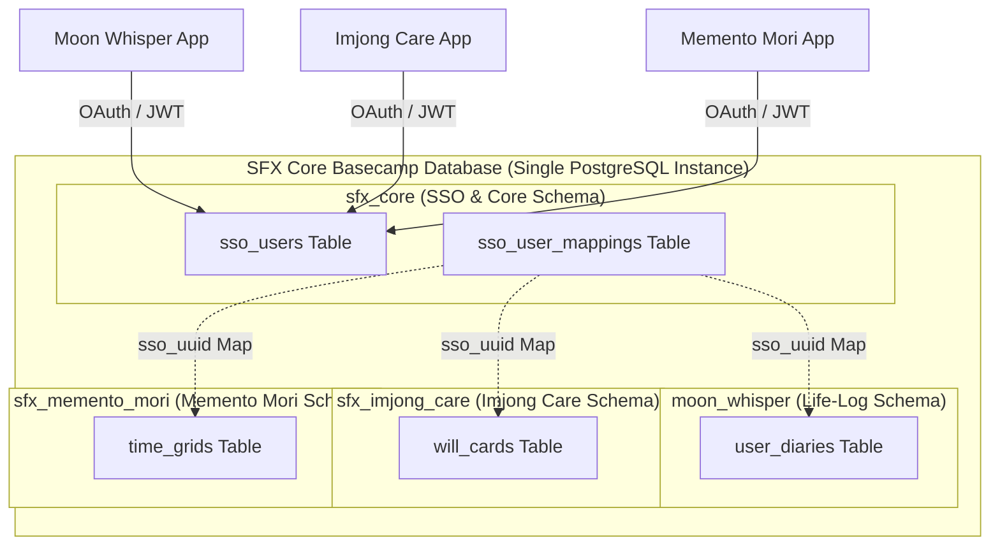

# [Business Factory Series] Chapter 4. Beyond Fragmentation: Cross-Platform Authentication (SSO)
**Subtitle: Multi-Tenant Schema Isolation and Shared Identity Layer as a Cross-Pollination Strategy for Solo Developers**

In Chapter 3, we demonstrated the capabilities of **Agent-Driven Development (ADD)**, where a local AI agent system (Hermes & OpenAgent) operates an autonomous assembly line—taking high-level blueprints to generate source code, run self-healing compilation loops, and execute integrated QA validations. This system empowers solo developers to design, test, and scaffold fully functional MVP applications within a single day.

However, behind this accelerated development velocity lies a critical business challenge: **user experience fragmentation** and **customer acquisition costs (CAC)**.

Even if a solo developer can deploy new applications rapidly, isolating each database and requiring independent registration flows will ultimately hinder user adoption. If users must verify their email addresses and configure passwords repeatedly to try a new service (such as Memento Mori ⌛), the friction will lead to high churn rates. Furthermore, marketing each new product as an isolated brand means the developer faces recurring user acquisition costs from scratch.

To overcome this bottleneck and bind these disparate apps into a unified, cohesive product suite, we implemented a **cross-platform Single Sign-On (SSO) and a multi-tenant database architecture**. In this chapter, we disclose the technical implementation and design philosophy behind our cross-app authentication infrastructure, hosted cost-effectively on a flat-rate $5 Virtual Private Server (VPS) utilizing Docker-compose and PostgreSQL.

---

### 🏛️ Architectural Overview: Single Instance, Isolated Schemas, Shared Mapping

In typical enterprise architectures, organizations deploy microservices (MSA) where each service maintains its own isolated database instance, communicating through API gateways. For a solo developer managing limited budgets and operational bandwidth, this pattern represents infrastructure over-engineering and escalates hosting expenses.

Conversely, dumping all multi-application data into a single, massive database table compromises data privacy boundaries, increases schema management risks, and violates modularity principles.

The architectural compromise chosen by Solve-for-X is **multi-tenant schema isolation within a single PostgreSQL database instance**.



This setup operates on three core principles:
1. **Physical Unification, Logical Isolation:** We run a single PostgreSQL container on a low-cost $5/month VPS. However, within the database engine, we enforce logical boundaries by separating application data into distinct namespaces (`moon_whisper`, `sfx_imjong_care`, `sfx_memento_mori`).
2. **Shared Authentication Core:** Only the central identity schemas (`sfx_core.sso_users` and `sfx_core.sso_user_mappings`) are shared across all tenants.
3. **Token-Based Federated Auth:** When a user authenticates through any application in the ecosystem, the authorization request resolves back to the central SSO hub. This hub issues a signed JSON Web Token (JWT) containing a unique `sso_uuid`, allowing the client application to query only its respective isolated schema.

---

### 🛠️ Database Modeling and Cross-Schema Automated Triggers

Let's examine the SQL migration script that realizes this architecture. The following configuration establishes the shared SSO schema and registers database triggers to automatically initialize service-specific profiles whenever a user creates an account:

```sql
-- 1. Declare the Shared SSO Schema
CREATE SCHEMA IF NOT EXISTS sfx_core;

-- Centralized Users Table
CREATE TABLE sfx_core.sso_users (
    sso_uuid UUID PRIMARY KEY DEFAULT gen_random_uuid(),
    email VARCHAR(255) UNIQUE NOT NULL,
    hashed_password VARCHAR(255) NOT NULL,
    created_at TIMESTAMP WITH TIME ZONE DEFAULT CURRENT_TIMESTAMP,
    updated_at TIMESTAMP WITH TIME ZONE DEFAULT CURRENT_TIMESTAMP
);

-- Cross-Service Tenant Mapping Table
CREATE TABLE sfx_core.sso_user_mappings (
    id SERIAL PRIMARY KEY,
    sso_uuid UUID REFERENCES sfx_core.sso_users(sso_uuid) ON DELETE CASCADE,
    target_service VARCHAR(50) NOT NULL, -- e.g., 'imjong_care', 'memento_mori', 'moon_whisper'
    tenant_user_id VARCHAR(100) NOT NULL, -- Isolated local identifier inside the specific schema
    linked_at TIMESTAMP WITH TIME ZONE DEFAULT CURRENT_TIMESTAMP,
    UNIQUE(sso_uuid, target_service)
);

-- 2. Declare an Isolated Tenant Schema (e.g., Imjong Care)
CREATE SCHEMA IF NOT EXISTS sfx_imjong_care;

CREATE TABLE sfx_imjong_care.user_profiles (
    tenant_user_id UUID PRIMARY KEY,
    sso_uuid UUID NOT NULL,
    display_name VARCHAR(100),
    is_premium BOOLEAN DEFAULT FALSE,
    last_login TIMESTAMP WITH TIME ZONE DEFAULT CURRENT_TIMESTAMP
);

-- 3. Define a Cross-Schema Trigger to Dynamically Provision Shell Profiles
CREATE OR REPLACE FUNCTION sfx_core.fn_sync_tenant_profile()
RETURNS TRIGGER AS $$
BEGIN
    -- Automatically provision a shell user record in the specific tenant space when signed up via SSO
    INSERT INTO sfx_imjong_care.user_profiles (tenant_user_id, sso_uuid, display_name)
    VALUES (gen_random_uuid(), NEW.sso_uuid, split_part(NEW.email, '@', 1));
    
    -- Register mapping reference
    INSERT INTO sfx_core.sso_user_mappings (sso_uuid, target_service, tenant_user_id)
    SELECT NEW.sso_uuid, 'imjong_care', tenant_user_id::text
    FROM sfx_imjong_care.user_profiles
    WHERE sso_uuid = NEW.sso_uuid;

    RETURN NEW;
END;
$$ LANGUAGE plpgsql;

CREATE TRIGGER trg_after_sso_signup
AFTER INSERT ON sfx_core.sso_users
FOR EACH ROW
EXECUTE FUNCTION sfx_core.fn_sync_tenant_profile();
```

Through this database-level trigger, users automatically receive an isolated tenant profile inside every application within the ecosystem upon initial registration. If we introduce a new app created by our autonomous business factory, we can expand our infrastructure footprint using simple DDL additions.

---

### 🌐 Cross-Platform Client Integration: Deep Links & JWT Orchestration

To streamline single sign-on across mobile apps built with Flutter and next-gen web frameworks, Solve-for-X routes authentication through a centralized **Web Identity Hub**.

1. **Authentication Trigger (Mobile -> Web Hub):** When a user taps the sign-in button in a Flutter client (e.g., `Imjong Care`), the app initiates a secure web view or system browser redirecting to the `Solve-for-X Identity Web Hub`. This request passes parameters specifying the calling client schema and its respective deep link return path (e.g., `sfx-imjong://auth-callback`).
2. **Session Persistence (Web SSO):** If the user is already authenticated in the browser against the `Solve-for-X` domain, the Web Hub reads the cookie session, bypasses credential verification, and generates a new authentication payload.
3. **Deep Link Token Delivery (Web -> Mobile):** Upon authorization, the Web Hub redirects the browser to the client's custom deep link scheme: `sfx-imjong://auth-callback?token=JWT_TOKEN_HERE`.
4. **Local Storage and Authenticated API Communications:** The native Flutter app intercepts this deep link, extracts the JWT, and saves it in secure local memory (`FlutterSecureStorage`). For all subsequent API requests, it attaches this credential inside the `Authorization: Bearer <JWT_TOKEN>` header to securely communicate with backend APIs.

By utilizing this asynchronous orchestration, we avoid the overhead of implementing platform-specific OAuth SDKs for every individual application. Our autonomous agent simply injects a unified, standardized `Deep Link Handler` block during the application scaffolding stage.

---

### 🚀 Business Synergies: The Power of User Cross-Pollination

The primary business benefit of this shared identity layer is the **acceleration of customer lock-in and zero-cost cross-pollination** across the product portfolio.

*   **Minimizing Customer Acquisition Cost (CAC):** Suppose `Moon Whisper` (our diary app) successfully attracts 1,000 active organic users. When we introduce our second product, `Imjong Care`, these users can access the new application without navigating a separate registration flow. The application prompts them to "Continue with your Solve-for-X account," onboarding them instantly. Consequently, the marketing CAC for launching secondary services drops to **$0**.
*   **Strengthening Ecosystem Lock-in:** While each application serves a distinct functional purpose, their underlying datasets—life logging (`Moon Whisper`), daily mortality reflection (`Memento Mori`), and post-mortem digital inheritance (`Legacy Vault`) —are unified under one credential. This increases the cumulative value of user-generated data, making it difficult for users to switch to competitor products.
*   **Enhancing Brand Credibility:** Operating distinct, high-fidelity services that coordinate seamlessly under a single sign-on experience presents the solo company as a comprehensive, enterprise-level platform suite, enhancing brand authority.

---

### 🏁 Concluding Part 3: Establishing the Platform's Bedrock

Throughout the **Business Factory Series (Part 3)**, we have systematically established our solo product engine: architectural standardization (Chapter 1), modular Lego-like components (Chapter 2), agent-driven automated execution (Chapter 3), and our unified database and identity layers (Chapter 4). 

With these foundational systems deployed on our $5 VPS, the **Sisyphus Factory** has established a resilient, cost-efficient, and fully automated product development ecosystem.

In the upcoming **Product Deep-Dive Series (Part 4)**, we will examine the actual live applications created by this automated machinery.

We will begin Chapter 1 with **"Imjong Care: Simulating Your Final 7 Days,"** detailing the UX design, psychological rationale, and localized encryption strategies behind our digital mortality companion app. Stay tuned!
