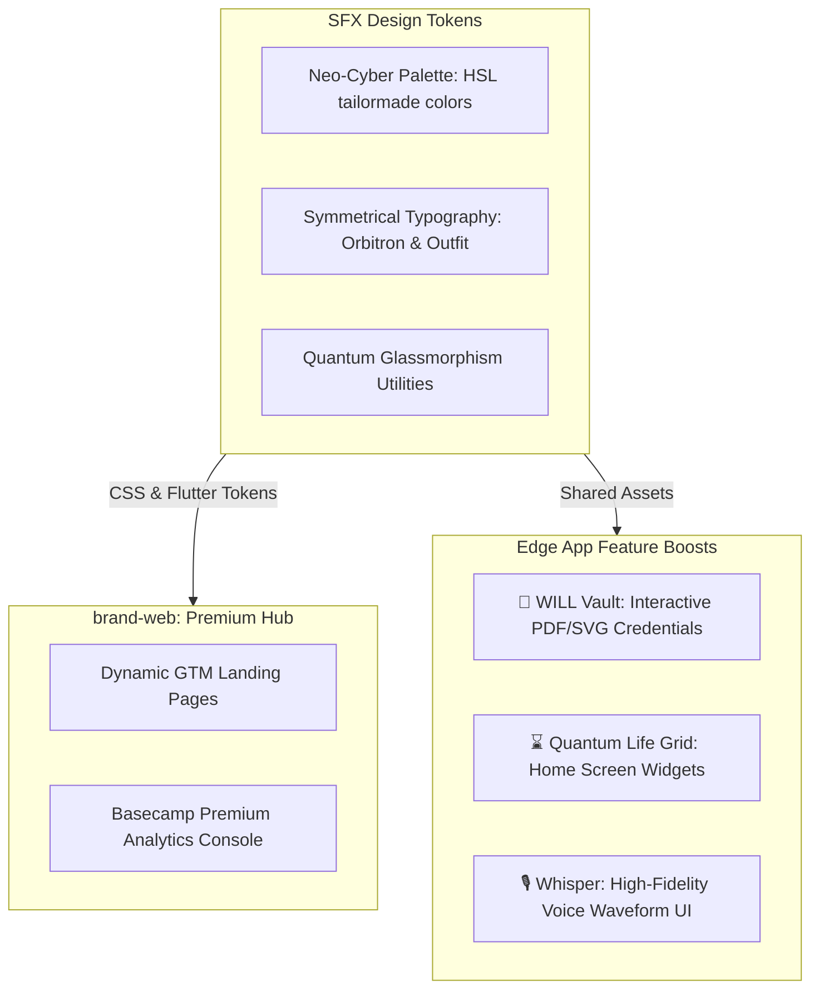
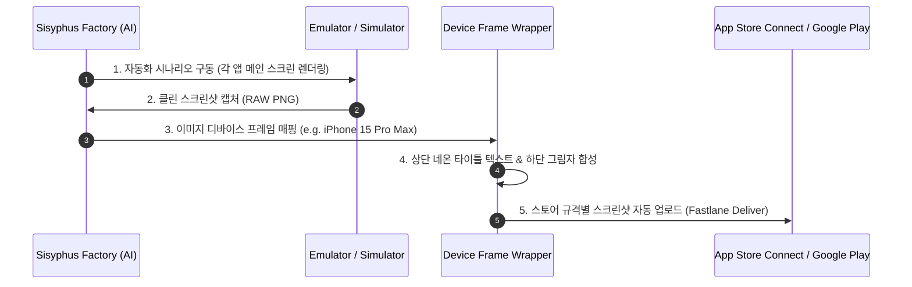

# 💎 Solve-for-X (SFX) Brand & Product Value Elevation Plan

> **본 설계서는 Solve-for-X (SFX) 생태계를 단순한 에이전트 실험용 소스코드 수준에서 완전히 탈피시키고, VC 투자 유치 및 일반 대중 시장(B2C)에서 최고 수준의 독점적 가치와 열광을 이끌어내기 위한 '상업 등급(Commercial-Grade) 브랜드 고도화 계획'입니다.**

---

## 🎨 1. Premium Brand Identity & Visual Language (시각 아이덴티티 통일)

SFX의 철학적 슬로건인 **"Dying Well = Living Well"**을 압도적인 하이테크 네온 비주얼로 브랜딩화하여, 유저가 브랜드를 대면하는 순간 강렬한 소유욕을 느끼게 합니다.

### 1.1. Neo-Cyber Color Palette (네오 사이버 색상 스키마 표준화)
모든 앱과 웹에 적용할 엄선된 HSL 색상 토큰을 일관되게 적용하여 "SFX 제품"군임을 시각적으로 증명합니다.
*   **SFX Cyber Pink (`#FF007F`):** 성찰과 인간 존엄성을 나타내는 대표 액센트 컬러.
*   **SFX Quantum Green (`#00FF66`):** 활기찬 생명력과 생애 그리드를 표현하는 라이브 컬러.
*   **SFX Deep Slate (`#09090F`):** 몰입감과 프리미엄 경험을 주는 다크 아웃라인 배경 컬러.
*   **SFX Void Indigo (`#1A0033`):** 신비로움과 영속적인 가치를 상징하는 베이스 섀도우 컬러.

### 1.2. Premium Typography System
*   **Header / Titles:** `Orbitron` (고도로 계산된 메카닉 & 테크니컬 느낌)을 사용하여 절대적인 보안성과 최첨단 신뢰감을 형성합니다.
*   **Body / Readability:** `Outfit` 또는 `Inter` (극도로 정돈되고 눈의 피로도를 최소화하는 산세리프 서체)를 일괄 바인딩하여 프리미엄 핀테크/의료 앱급 텍스트 퀄리티를 확보합니다.

---

## 🚀 2. Enterprise-Grade Feature Elevation (상업용 킬러 기능 설계)

단순한 입출력 폼(Form)을 뛰어넘는 상업 등급의 핵심 기능을 통해 앱의 실질적 가치를 극대화합니다.

### 2.1. App A (Imjong Care): "The Neon Will Vault"
*   **유언장의 실물 자산화 (Interactive Credentials):**
    *   작성 완료된 유언장을 클라이언트에서 암호화하여 DB에 업로드함과 동시에, 서버리스 렌더러를 통해 **최고급 맞춤형 디지털 SVG 및 인쇄 가능한 고품질 PDF 증서**로 자동 레이아웃팅하여 유저에게 발송합니다.
    *   유저의 고유 서명(Signature SVG)을 블록체인 타임스탬프와 매핑하여 유언의 진위성과 프리미엄 가치를 높입니다.

### 2.2. App B (Memento Mori): "The Quantum Life Grid Widgets"
*   **홈 스크린 위젯(Home Screen Widget) 개발:**
    *   앱에 들어가지 않더라도 매시간 흘러가는 남은 인생의 격자를 스마트폰 홈 화면(iOS WidgetKit & Android AppWidget)에서 네온 라이브로 확인할 수 있는 초소형 Quantum Grid 위젯을 설계합니다.
    *   **생애 잔여 시간 마이크로-카운터:** 밀리초 단위로 숫자가 리액티브하게 줄어드는 미세 애니메이션을 위젯에 이식하여, 유저가 스마트폰을 켤 때마다 삶의 강렬한 자극을 받도록 설계합니다.

### 2.3. App MW (Moon Whisper): "Hi-Fi Voice Waveform Visualization"
*   **음성 분석 인터페이스 극대화:**
    *   음성 녹음 중 실시간 오디오 입력 신호를 파싱하여 감정 네온 컬러에 맞춰 변화하는 **High-Fidelity 3D Web Audio Waveform 애니메이션**을 탑재합니다.
    *   녹음이 끝나면 AI가 실시간으로 분석한 감정 추이를 프리미엄 오라클 디자인 차트(Radar/Glow Chart)로 랜더링하여 시각적 만족감을 선사합니다.

---

## 🤖 3. Go-To-Market (GTM) & Store Automation (무인 마케팅 자동화)

설계자가 스토어 등록용 마케팅 이미지와 홍보 랜딩 페이지를 일체의 수작업 없이 100% 무인 생산하도록 팩토리 엔진을 확장합니다.

### 3.1. 무인 스크린샷 프레임 합성 엔진 (Screenshot Framing Automations)
*   **기능 사양:** `VisualRegressionQA` 모듈을 연장하여, 캡처된 원본 스크린샷에 **고급 스마트폰 목업 디바이스 프레임(iPhone, Android)**을 씌우고, 상단에 네온 그라데이션 타이틀 문구(예: *"당신의 남은 삶을 4,160주 격자로 통찰하십시오"*)를 동적 합성하여 앱스토어 심사용 규격 이미지로 자동 생산합니다.

### 3.2. Dynamic Landing Pages with Pricing Tiers
*   `brand-web` 컨트롤 타워가 새로운 앱 런칭을 감지하면 즉시 **최고급 네온 테마의 GTM 랜딩 페이지**를 동적 라우팅으로 호스팅합니다.
*   **3대 비즈니스 등급 요금제 컴포넌트 자동 노출:**
    1.  **Light Tier (Free):** 로컬 저장 기반 기본 그리드 확인 및 유언장 1회 보관.
    2.  **Quantum Tier (Premium, 월 $2.99):** Basecamp 통합 DB 실시간 암호화 동기화, 홈 위젯 연동, 감정 추이 리포트 무제한 분석.
    3.  **Legacy Tier (Lifetime, $29.99):** 영구 유언 보존, 블록체인 서명 등록, 인쇄용 프리미엄 PDF 유언 증서 실물 배송 서비스.

---

## 📋 4. Open Questions for Jihun (지훈님 검토 필요 사항)

> [!IMPORTANT]
> **성공적인 상업 브랜딩화를 위한 지훈님의 의사결정 포인트**
> 
> 1. **결제 결속 방식:** 인앱 결제(Apple In-App Purchase & Google Play Billing)를 Native Flutter에 직접 인젝션하여 빌드할 것인가, 혹은 `brand-web` Next.js에서 PG사(예: Toss Payments / Stripe) 결제 링크를 활용한 통합 SSO 웹 결제 방식을 채택할 것인가? (웹 결제가 수수료와 이식이 극히 저렴합니다.)
> 2. **실물 배송 결합 여부:** `Imjong Care` 유언장을 실제 왁스 실링 처리된 고급 하드커버 실물 우편으로 유저의 법적 대리인에게 배송하는 오프라인 비즈니스 모델(Legacy Tier)의 구현 타당성 여부.
> 3. **@Moon_Whisper 이주 시점:** 기존 Supabase/Firebase 클라우드에 적재되어 있던 라이브 회원 데이터를 우리의 Docker PostgreSQL 통합 DB 스키마로 이관하는 실제 배포(Migration Run) 단계를 로드맵 1순위로 즉각 실행할 것인가?
