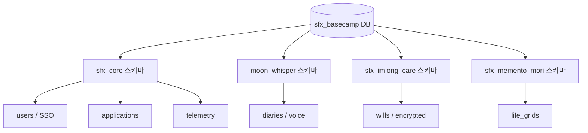
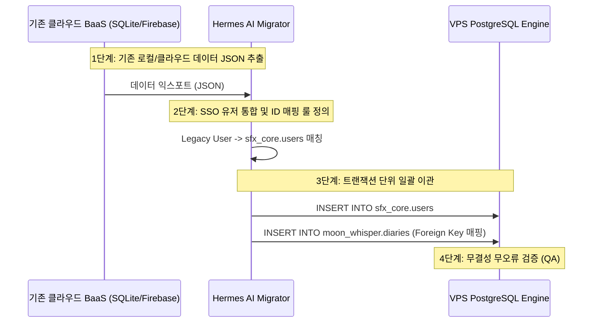

# Solve-for-X (SFX) Basecamp Unified Database Migration Blueprint

이 설계서는 개별 클라우드 BaaS 과금 구조를 피하고, 단일 VPS 가상 서버의 PostgreSQL 통합 DB 환경에서 `@Moon_Whisper` 및 모든 SFX 앱 데이터를 통합·수용하기 위한 스키마 설계 및 데이터 이주(Migration) 전략 로드맵입니다.

---

## 🏛️ 1. 멀티테넌트 데이터베이스 아키텍처 (Multi-tenant Schema)

단일 PostgreSQL 인스턴스 내에서 **물리적 스키마(Schema) 분리** 기법을 적용하여 완벽한 데이터 논리적 격리와 관리 단순화를 동시 달성합니다.



---

## 🗄️ 2. 상세 DDL 및 데이터 매핑 정의

### 2.1. `sfx_core` 스키마 (통합 SSO 및 관제)
모든 서비스의 통합 회원 연동(SSO)과 플랫폼 라이선스를 일괄 관제하는 핵심 중추입니다.

```sql
-- 1. 통합 유저 테이블 (SSO)
CREATE TABLE sfx_core.users (
    id UUID PRIMARY KEY DEFAULT gen_random_uuid(),
    email VARCHAR(255) UNIQUE NOT NULL,
    password_hash VARCHAR(255) NOT NULL,
    nickname VARCHAR(100),
    avatar_url TEXT,
    created_at TIMESTAMP WITH TIME ZONE DEFAULT CURRENT_TIMESTAMP,
    updated_at TIMESTAMP WITH TIME ZONE DEFAULT CURRENT_TIMESTAMP
);

-- 2. 등록 어플리케이션 테이블
CREATE TABLE sfx_core.applications (
    app_id VARCHAR(50) PRIMARY KEY,
    name VARCHAR(100) NOT NULL,
    description TEXT,
    api_key_hash VARCHAR(255) UNIQUE NOT NULL,
    created_at TIMESTAMP WITH TIME ZONE DEFAULT CURRENT_TIMESTAMP
);

-- 3. 유저-앱 권한/라이선스 매핑 테이블
CREATE TABLE sfx_core.user_applications (
    user_id UUID REFERENCES sfx_core.users(id) ON DELETE CASCADE,
    app_id VARCHAR(50) REFERENCES sfx_core.applications(app_id) ON DELETE CASCADE,
    tier VARCHAR(30) DEFAULT 'free', -- free, premium, life-time
    activated_at TIMESTAMP WITH TIME ZONE DEFAULT CURRENT_TIMESTAMP,
    PRIMARY KEY (user_id, app_id)
);
```

### 2.2. `moon_whisper` 스키마 (이주 대상)
기존에 흩어져 있던 감정 목소리 일기 데이터를 구조화하여 통합 수용합니다.

```sql
-- 1. 음성 감정 분석 일기장 테이블
CREATE TABLE moon_whisper.diaries (
    id UUID PRIMARY KEY DEFAULT gen_random_uuid(),
    user_id UUID REFERENCES sfx_core.users(id) ON DELETE CASCADE,
    title VARCHAR(200),
    content TEXT NOT NULL,
    voice_record_path TEXT, -- CDN 혹은 VPS 자체 스토리지 내 볼륨 마운트 경로
    emotion_score NUMERIC(5, 2), -- -100.00 ~ 100.00
    theme_neon_color VARCHAR(10) DEFAULT '#00FF66',
    created_at TIMESTAMP WITH TIME ZONE DEFAULT CURRENT_TIMESTAMP,
    updated_at TIMESTAMP WITH TIME ZONE DEFAULT CURRENT_TIMESTAMP
);

-- 2. 감정 추이 타임라인 로그 테이블
CREATE TABLE moon_whisper.emotions (
    id BIGSERIAL PRIMARY KEY,
    user_id UUID REFERENCES sfx_core.users(id) ON DELETE CASCADE,
    mood_tag VARCHAR(50) NOT NULL,
    intensity INTEGER CHECK (intensity BETWEEN 1 AND 10),
    logged_date DATE DEFAULT CURRENT_DATE
);
```

### 2.3. `sfx_imjong_care` 스키마 (App A)
지훈님이 고안하신 유언장 네온 테마 카드 및 종말 성찰 콘텐츠 데이터 모델입니다.

```sql
-- 1. 유언장 데이터 (보안 최우선: AES-256 디코딩 처리는 클라이언트 기기에서 수행)
CREATE TABLE sfx_imjong_care.wills (
    id UUID PRIMARY KEY DEFAULT gen_random_uuid(),
    user_id UUID REFERENCES sfx_core.users(id) ON DELETE CASCADE,
    encrypted_content TEXT NOT NULL, -- AES-256 암호화된 유언장 본문
    card_neon_theme VARCHAR(20) DEFAULT 'HOT_PINK',
    signature_svg TEXT,
    created_at TIMESTAMP WITH TIME ZONE DEFAULT CURRENT_TIMESTAMP,
    updated_at TIMESTAMP WITH TIME ZONE DEFAULT CURRENT_TIMESTAMP
);
```

### 2.4. `sfx_memento_mori` 스키마 (App B)
생애 4,160주 시각화 및 남은 인생 로깅 스키마입니다.

```sql
-- 1. 유저 생애 그리드 설정 테이블
CREATE TABLE sfx_memento_mori.life_grids (
    user_id UUID PRIMARY KEY REFERENCES sfx_core.users(id) ON DELETE CASCADE,
    birth_date DATE NOT NULL,
    target_age INTEGER DEFAULT 80 CHECK (target_age BETWEEN 1 AND 150),
    created_at TIMESTAMP WITH TIME ZONE DEFAULT CURRENT_TIMESTAMP
);
```

---

## 🔒 3. 데이터 보안 및 암호화 설계 (Zero-Knowledge Architecture)

*   **원칙:** "인프라 관리자도 유저의 유언(Wills)과 비밀 일기는 읽을 수 없다."
*   **구현 아키텍처:**
    1.  클라이언트(App) 로그인 시 생성된 마스터 패스워드와 기기 고유 키(Secure Storage)를 조합하여 로컬 PBKDF2 암호화 키를 파생시킵니다.
    2.  유언장이나 내밀한 감정 일기 작성 시, 로컬에서 **AES-GCM-256** 알고리즘으로 본문을 암호화합니다.
    3.  통합 PostgreSQL DB 서버에는 오직 **암호화된 문자열(Base64)**만 송신 및 보관합니다.
    4.  이를 통해 VPS 해킹이나 DB 유출 사고가 발생하더라도 사용자 프라이버시가 100% 철저히 규격 보호됩니다.

---

## ✈️ 4. 단계별 데이터 마이그레이션 전략 (Migration Steps)



1.  **1단계 (Extraction):** 기존 `Moon_Whisper` 로컬 SQLite 및 Firebase DB 엔트리를 암호화 규격(JSON)으로 내보냅니다.
2.  **2단계 (SSO Mapping):** 구글/애플 인증을 결속한 SSO 유저 엔트리를 `sfx_core.users`로 최초 임포트하여 새로운 UUID를 발급합니다.
3.  **3단계 (Transform & Load):** 기존 diaries 로그를 `moon_whisper.diaries`에 순차적으로 로드하며, user_id 외래키(Foreign Key)를 새롭게 매핑합니다.
4.  **4단계 (Holographic Verification):** AI 검증 러너가 누락 레코드 및 스키마 위반율 0% 임을 스냅샷 비교 검증하고 최종 컷오버(Cut-over)를 승인합니다.
