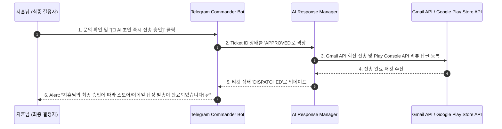

# 🛠️ CS & Support Ticketing Automation System (Engineering Spec)

본 문서는 Solve-for-X (SFX) 하위 플랫폼들 및 브랜드 컨트롤 타워에서 공통으로 적용할 **무인 운영 CS 및 스토어 리뷰 자동 분류/정리 파이프라인**에 대한 구체적인 데이터베이스 스키마와 에이전트 자율 대응 설계 사양서입니다.

---

## 💾 1. Database Schema Specification (티켓 저장 스키마 명세)

통합 Basecamp PostgreSQL 데이터베이스 내에 멀티테넌트 및 SSO 유저 테이블과 조인(Join)되는 지원 티켓 테이블을 생성합니다.

```sql
-- Create Support Tickets Table inside Unified PostgreSQL Database
CREATE TABLE IF NOT EXISTS sfx_core.support_tickets (
    ticket_id UUID PRIMARY KEY DEFAULT gen_random_uuid(),
    app_id VARCHAR(50) NOT NULL,                    -- 'imjong_care', 'memento_mori', 'moon_whisper', etc.
    source VARCHAR(20) NOT NULL,                    -- 'EMAIL', 'PLAY_STORE', 'APP_STORE'
    raw_identifier VARCHAR(255),                    -- Google Play Review ID or Email Message-ID
    user_id UUID REFERENCES sfx_core.users(id) ON DELETE SET NULL, -- SSO User matching
    subject VARCHAR(255),
    content TEXT NOT NULL,
    urgency VARCHAR(20) DEFAULT 'MEDIUM',          -- 'CRITICAL', 'HIGH', 'MEDIUM', 'LOW'
    intent VARCHAR(30),                             -- 'BUG_REPORT', 'FEATURE_REQUEST', 'BILLING', 'SSO_INQUIRY'
    sentiment VARCHAR(20) DEFAULT 'NEUTRAL',        -- 'ANGRY', 'NEUTRAL', 'HAPPY'
    status VARCHAR(20) DEFAULT 'OPEN',              -- 'OPEN', 'APPROVED', 'DISPATCHED', 'CLOSED'
    assigned_agent VARCHAR(50) DEFAULT 'HERMES',
    ai_draft_response TEXT,
    is_buffered BOOLEAN DEFAULT FALSE,              -- True if received during sleeping hours (23:00 - 08:00)
    created_at TIMESTAMP WITH TIME ZONE DEFAULT CURRENT_TIMESTAMP,
    updated_at TIMESTAMP WITH TIME ZONE DEFAULT CURRENT_TIMESTAMP
);

-- Indexing for high-performance SRE queries
CREATE INDEX IF NOT EXISTS idx_tickets_app_urgency ON sfx_core.support_tickets(app_id, urgency);
CREATE INDEX IF NOT EXISTS idx_tickets_status_buffered ON sfx_core.support_tickets(status, is_buffered);
CREATE INDEX IF NOT EXISTS idx_tickets_created ON sfx_core.support_tickets(created_at);
```

---

## ⚙️ 2. Autonomous Ingestion Parser (Gmail API & Ingestion Concept Code)

지훈님의 결정에 따라 맞춤 메일 서버 구축 대신, **기존 개인 Gmail 계정의 Gmail API** 및 Google 스토어 API를 연동하여 1시간 배치 크론으로 수집을 수행합니다.

```python
# scripts/factory/support/ticket_ingestion_parser.py
import os
import json
import datetime
from google.oauth2.credentials import Credentials
from googleapiclient.discovery import build
import requests

class TicketIngestionParser:
    def __init__(self, config):
        self.creds = Credentials.from_authorized_user_file(config['gmail_token_path'])
        self.gmail_service = build('gmail', 'v1', credentials=self.creds)
        self.ai_endpoint = config['ai_classifier_endpoint']

    def fetch_hourly_emails(self):
        # Calculate time delta for 1 hour ago
        one_hour_ago = datetime.datetime.now() - datetime.timedelta(hours=1)
        query = f"label:INBOX after:{int(one_hour_ago.timestamp())}"
        
        results = self.gmail_service.users().messages().list(userId='me', q=query).execute()
        messages = results.get('messages', [])
        ticket_payloads = []
        
        for msg_meta in messages:
            msg = self.gmail_service.users().messages().get(userId='me', id=msg_meta['id']).execute()
            headers = msg['payload']['headers']
            subject = next(h['value'] for h in headers if h['name'] == 'Subject')
            message_id = next(h['value'] for h in headers if h['name'] == 'Message-ID')
            body = msg['snippet'] # Simplified text extraction
            
            ticket_payloads.append({
                "source": "EMAIL",
                "subject": subject,
                "content": body,
                "raw_identifier": message_id
            })
        return ticket_payloads
```

---

## 💬 3. Telegram Approved-Response Action Flow (최종 결정자 승인 전송)

지훈님의 결정에 따라, 인공지능이 무인 자율 직접 발송을 하지 않고 **지훈님의 1-Click 승인을 대기하는 "Approved-Reply"** 릴리즈 게이트로 보안 통제합니다.



---

## 💤 4. 수면 모드 버퍼링 & 굿모닝 일괄 브리핑 (Smart Sleep Buffer & Briefing)

지훈님의 취침 시간 동안 무소음 수면 환경을 보장하기 위해 지능형 브리핑 버퍼링 시스템을 구현합니다.

*   **수면 시간 통제대 (23:00 ~ 08:00):**
    *   **Low, Medium, High 등급 티켓:** Telegram 실시간 알림을 발송하지 않고 `is_buffered = TRUE`로 설정하여 DB에 조용히 저장합니다.
    *   **Critical 등급 티켓 (예: 서버 다운, 결제 먹통):** 지훈님을 깨울 수 있는 **[🚨 SRE EMERGENCY PAGER ALERT]**가 예외적으로 즉시 격상 발송됩니다.
*   **🌞 굿모닝 데일리 브리핑 (오전 08:00):**
    *   매일 아침 8시 정각, 수면 중 버퍼링된 모든 티켓들을 긴급도 순으로 요약 컴파일하여 **"단 하나의 일괄 브리핑 카드"**로 일러줍니다.
    *   카드의 액션 패널에서 각각의 문의에 대해 순차적으로 **승인 및 편집 버튼**을 제공해 아침 업무 효율을 10배로 단축시킵니다.

```
+-------------------------------------------------------------+
| 🌞 Good Morning 지훈님! 수면 중 접수된 CS 브리핑 (총 4건)    |
+-------------------------------------------------------------+
| • [High] Memento Mori 유저: 결제 후 그리드 언락 지연          |
|   -> AI 제안 답변 준비완료 [확인 및 답장 승인]              |
| • [Medium] Imjong Care 유저: 서명 SVG 업로드 딜레이            |
|   -> AI 제안 답변 준비완료 [확인 및 답장 승인]              |
+-------------------------------------------------------------+
```

---

> [!NOTE]
> 본 설계서는 지훈님의 결정사항을 100% 반영하여 수립된 **Solve-for-X 브랜드 관리 운영 규격**입니다. 로컬 데이터베이스의 `02-init-ticketing.sql` 스키마 설계에 해당 버퍼링 컬럼(`is_buffered`)이 영구 반영되었습니다.