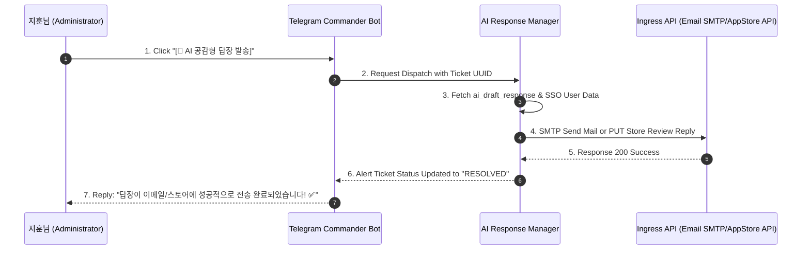

# 🛠️ CS & Support Ticketing Automation System (Engineering Spec)

본 문서는 Solve-for-X (SFX) 하위 플랫폼들 및 브랜드 컨트롤 타워에서 공통으로 적용할 **무인 운영 CS 및 스토어 리뷰 자동 분류/정리 파이프라인**에 대한 구체적인 데이터베이스 스키마와 에이전트 자율 대응 설계 사양서입니다.

---

## 💾 1. Database Schema Specification (티켓 저장 스키마 명세)

통합 Basecamp PostgreSQL 데이터베이스 내에 멀티테넌트 및 SSO 유저 테이블과 조인(Join)되는 지원 티켓 테이블을 생성합니다.

```sql
-- Create Support Tickets Table inside Unified PostgreSQL Database
CREATE TABLE IF NOT EXISTS sfx_core.support_tickets (
    ticket_id UUID PRIMARY KEY DEFAULT gen_random_uuid(),
    app_id VARCHAR(50) NOT NULL,                    -- 'imjong_care', 'memento_mori', 'moon_whisper', etc.
    source VARCHAR(20) NOT NULL,                    -- 'EMAIL', 'PLAY_STORE', 'APP_STORE'
    raw_identifier VARCHAR(255),                    -- Google Play Review ID or Email Message-ID
    user_id UUID REFERENCES sfx_core.users(id),     -- Nullable (if anonymous user)
    subject VARCHAR(255),
    content TEXT NOT NULL,
    urgency VARCHAR(20) DEFAULT 'MEDIUM',          -- 'CRITICAL', 'HIGH', 'MEDIUM', 'LOW'
    intent VARCHAR(30),                             -- 'BUG_REPORT', 'FEATURE_REQUEST', 'BILLING', 'SSO_INQUIRY'
    sentiment VARCHAR(20) DEFAULT 'NEUTRAL',        -- 'ANGRY', 'NEUTRAL', 'HAPPY'
    status VARCHAR(20) DEFAULT 'OPEN',              -- 'OPEN', 'INVESTIGATING', 'RESOLVED', 'CLOSED'
    assigned_agent VARCHAR(50) DEFAULT 'HERMES',
    ai_draft_response TEXT,
    created_at TIMESTAMP WITH TIME ZONE DEFAULT CURRENT_TIMESTAMP,
    updated_at TIMESTAMP WITH TIME ZONE DEFAULT CURRENT_TIMESTAMP
);

-- Indexing for high-performance SRE queries
CREATE INDEX idx_tickets_app_urgency ON sfx_core.support_tickets(app_id, urgency);
CREATE INDEX idx_tickets_status ON sfx_core.support_tickets(status);
```

---

## ⚙️ 2. Autonomous Ingestion Parser (IMAP & API Ingestion Concept Code)

이메일 채널에서 신규 문의를 자동 폴링하고 파싱하여 PostgreSQL 데이터베이스에 저장하는 파이썬 크론 데몬의 구현 아키텍처입니다.

```python
# scripts/factory/support/ticket_ingestion_parser.py
import imaplib
import email
from email.header import decode_header
import json
import requests

class TicketIngestionParser:
    def __init__(self, config):
        self.imap_server = config['imap_server']
        self.username = config['username']
        self.password = config['password']
        self.ai_endpoint = config['ai_classifier_endpoint']

    def fetch_latest_emails(self):
        mail = imaplib.IMAP4_SSL(self.imap_server)
        mail.login(self.username, self.password)
        mail.select("inbox")
        
        # Search for unseen support emails
        status, messages = mail.search(None, 'UNSEEN')
        ticket_payloads = []
        
        for num in messages[0].split():
            status, data = mail.fetch(num, '(RFC822)')
            raw_email = data[0][1]
            msg = email.message_from_bytes(raw_email)
            
            subject = decode_header(msg["Subject"])[0][0]
            if isinstance(subject, bytes):
                subject = subject.decode()
                
            body = ""
            if msg.is_multipart():
                for part in msg.walk():
                    if part.get_content_type() == "text/plain":
                        body = part.get_payload(decode=True).decode()
            else:
                body = msg.get_payload(decode=True).decode()
                
            ticket_payloads.append({
                "source": "EMAIL",
                "subject": subject,
                "content": body,
                "raw_identifier": msg["Message-ID"]
            })
        return ticket_payloads

    def classify_and_save_ticket(self, raw_ticket):
        # AI Triage Model call to classify sentiment, intent, and urgency
        headers = {"Content-Type": "application/json"}
        response = requests.post(self.ai_endpoint, json=raw_ticket, headers=headers)
        analysis = response.json()  # Contains: urgency, intent, sentiment, ai_draft
        
        # Save to database (PostgreSQL database handler call)
        ticket_record = {**raw_ticket, **analysis}
        print(f"💎 Ticket Processed: Urgency={ticket_record['urgency']} | Sentiment={ticket_record['sentiment']}")
        return ticket_record
```

---

## 💬 3. Telegram Auto-Response Action Flow (1-Click Action Flow)

AI가 생성한 초안(ai_draft_response)을 검토한 후 승인 버튼 클릭 시 전송 매커니즘:



---

> [!NOTE]
> 본 기술 설계서는 [goal.md](file:///Users/apple/development/soluni/Solve-for-X/docs/plans/goal.md)의 Phase 2 (자율 QA 및 무인 자동화 루프) 단계에 포함될 핵심 연동 규격입니다. 본 문서에 근거하여 로컬 DB 마이그레이션 및 파이썬 파서 데몬을 구축할 준비를 마쳤습니다.
